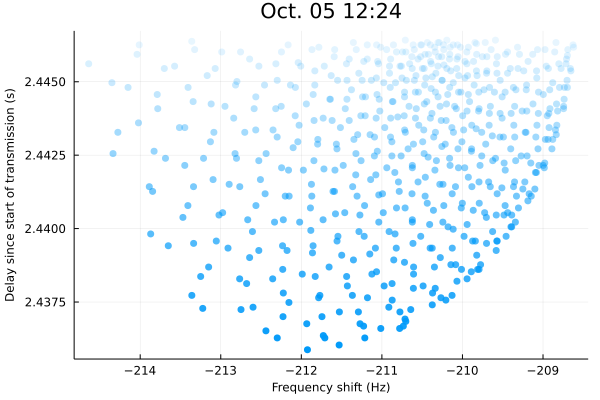

# Moon Bounce

A Julia program and Pluto.jl notebook to recreate a version of this really cool delay-Doppler plot from a neat [radio experiment](https://lacuna.space/lora-moon-bounce/):

<table>
	<tr><td><center><b>Real Experiment</b></center></td><td><center><b>My Simulation</b></center></td></tr>
	<tr>
		<td>
      </img>
      </br>
      <center><i>(Image from <a href="https://lacuna.space/lora-moon-bounce/">Lacuna Space</a>)</i></center>
     </td>
		<td></img></td>
	</tr>
</table>

More detail in my [blog post](https://jthatch.com/notes/Physics/RecreatingaMoonBounceDelayDopplerPlot.html)

## Usage
`moonbounce.jl` is a [Pluto.jl](https://github.com/fonsp/Pluto.jl) notebook, so it's best viewed in the Pluto.jl viewer.

However you can also just run the program directly with
```
$ # instantiate Julia modules
$ julia
julia > ]
(@v1.7) pkg> instantiate
(@v1.7) pkg> ^D
$ julia --project=. moonbounce.jl
```
but depending on your setup you might not see any images. 

## Quick Description
At a high level, this program follows this procedure to make Moon bounce delay-Doppler plots:
- Choose a transmitter location and time (I'm using October 5, 2021 at Dwingeloo)
- Generate a bunch of points on the Moon's surface. These will represented scatterers or reflectors on the Moon that will reflect the transmitted signal back to Earth
	- I finally had an excuse to use the Fibonacci sphere covering technique described by [extremelearning.com.au](http://extremelearning.com.au/how-to-evenly-distribute-points-on-a-sphere-more-effectively-than-the-canonical-fibonacci-lattice/)
- Calculate the time between transmission from the and incidence on the Moon at each reflector point, then also calculate the time it for a reflect from each point to return to the receiver on Earth
	- This is the bulk of the work of the program. It's made non-trivial because both the Earth and Moon are in motion. See the [`moonbounce` function](https://github.com/ThatcherC/moonbounce/blob/48688d414786b0718ffac4e45cb88695413b9253/moonbounce.jl#L140-L200) for implementation
- Take those signal delays to work out the positions and velocities of the transmitter and lunar reflector at transmit time, reflection time, and reception time
- Use positions and velocities to work out Doppler shift
- Plot!
